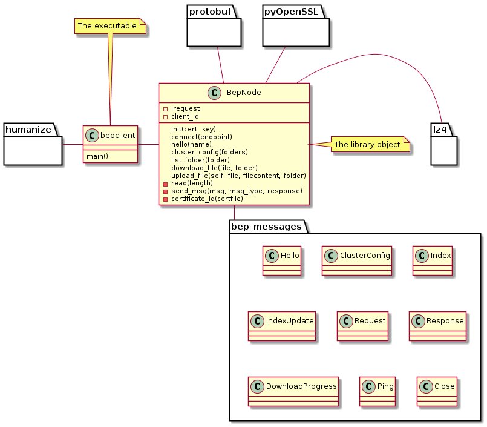

---
title: Block Exchange Protocol v1
author: Claudio Sousa
date: 2017
header-includes:
- \usepackage{pdfpages}
- \usepackage[english]{babel}
- \usepackage{hyperref}
- \hypersetup{colorlinks=true,  linkcolor=blue}
- \setcounter{tocdepth}{5}
- \usepackage{fancyhdr}
- \pagestyle{fancy}
- \fancyhead{}
- \fancyhead[CO,CE]{Conception de protocoles réseau}
- \fancyfoot[LE,RO]{\thepage}
- \fancyfoot[CO,CE]{Claudio Sousa}
header: This is fancy
footer: So is this
bibliography: biblio.bib
geometry:
 - left=1.5cm
 - right=1.5cm
 - top=2.5cm
 - bottom=2.5cm
nocite:
abstract:
...

\ \

\begin{center}
Conception de protocoles réseau

HEPIA
\end{center}

\newpage

\newpage

\tableofcontents

\newpage

# Introduction

Ce document est le résultat de l'étude du protocole *Block Exchange Protocol*[^2] (BEP), développé et implémenté par Syncthing [^1].
L'étude se décompose en deux chapitres:

Le premier chapitre, *Block Exchange Protocol*, décrit l'analyse faite sur le protocole du même nom.
On modélise le protocole depuis trois approches différentes:

 * Le diagramme d'états
 * Le diagramme de séquence
 * Le diagramme de classes des messages échangées

Dans le deuxième chapitre, *BEP Client*, on décrit le mini-projet consistant à implémenter une partie du protocole décrit au premier chapitre.

# Block Exchange Protocol

## Diagramme d'états

Dans ce diagramme d'états on montre en détail le cas nominal d'exécution: les différents états dans lesquels un noeud BEP peut se trouver, les conditions qui peuvent l'amener a transiter d'état et les actions liées à ces transitions. On décrit également les différents scenarios d'exécution qui peuvent amener le noeud a transiter vers un état d'exception.

La syntaxe utilisée est basée sur celle vue en cours, en particulier les notes sur les transitions ont la forme $\frac{condition}{action}$.

Le diagramme proposé ici respecte la contrainte forte que, pour chaque état, une seule condition de transition ne peut être vrai à la fois. Ceci est important pour avoir un comportement d'exécution prévisible.

Conceptuellement, la machine d'états est essentiellement réactive, réagissant à des événements déclenchés par la couche du dessus (l'application) ou à la réception d'un messages d'un noeud BEP pair. Dans notre diagramme, nous proposons une représentation séquentielle afin de tenir en compte la dimension du temps. Pour ce faire, nous utilisons des variables globales qui conditionnent le comportement de la machine à état des actions. Aussi, certaines actions que nous appelons lors des transitions n'ont pas de comportement spécifié dans ce document car leur comportement est implémenté par la couche du dessus. En general elles mettent à jour des variables globales qui vont conditionner le comportement de la machine à états.

### *Actions* et *conditions* communes

On définit ici quelques *actions* et *conditions* communes utilisées à plusieurs endroits du diagramme d'état. Les actions et conditions qui apparaissent une seule fois dans le diagramme sont décrites dans leur état respectif.

### Actions

Data.req:
  : demande à la couche en dessous (couche transport) d'envoyer le message passé en paramètre. Exemple: *Data.req(Hello)* pour envoyer un message Hello.

startTimer:
  : démarre le timer spécifié. Si le timer est en exécution, il est redémarré.

cancelTimer:
  : annule l'exécution du timer passé paramètre.

### Conditions

timerExpired:
  : le timer spécifié a expiré.

Data.ind:
  : un message du type spécifié a été reçu et son type est celui spécifié en paramètre.

      Exemples:

      * *Data.ind(Hello)* est vrai si le prochain message dans le buffer de réception est de type *Hello*.
      * *Data.ind(msg != Hello)* est vrai si le prochain message dans le buffer est de type différent de *Hello*.

### Les timers

Les timers décrits ici permettent de rajouter la dimension du temps dans le protocole. La valeur de leur temps n'est pas toujours précisée car dépendante de l'implémentation.

pingTimer:
  : determine le temps d'attente maximal depuis le dernier message envoyé au pair, avant l'envoi du message ping (*heartbeat*). Le protocole[^2] spécifie que la valeur de ce timer est de 90s.

downloadTimer:
  : vérifie si un *download* a toujours lieu afin de notifier la progression le cas échéant.

#### Timers d'exception

Lorsque ces timers expirent, un événement d'exception a lieu et la machine d'états passe à l'état [*handleException*](#handleException).

waitingResponseTimer:
  : détermine le temps maximal d'attente de réception d'un message.

peerPingTimer:
  : de valeur supérieure pingTimer, ce timer compte le temps depuis la dernière réception d'un message de la part du noeud pair.

downloadTimer:
  : mesure la fréquence à laquelle des messages DownloadProgress doivent être envoyés, si nécessaire.

### Variables

Lors de l'exécution de la machine d'états, quelques variables globales maintiennent des information de synchronisation.

newerBlocks:
  : cette variable représente tous les nouveaux blocks qui n'existent que localement et qui n'ont pas encore été annoncés au server. Souvent, ils résultent d'une modification du fichier effectuée par l'utilisateur (modification, ajout, suppression de fichier).

missingBlocks:
  : cette variable représente tous les nouveaux blocks qui existent chez le noeud pair mais pas chez nous, et dont le contenu n'a pas encore été demandé par un message *Request*.

### État d'exception *handleException*\label{handleException}

L'exécution de la machine d'état tombe dans cet état particulier lorsqu'un événement non attendu à lieu.

Quelques exemples:

  * On reçoit un message de type différent de *Hello* suite à l'envoi de notre *Hello*
  * On ne reçoit pas de réponse à notre message *Hello*

On spécifie dans notre diagramme d'états les conditions qui nous amènent dans cet état d'exception, mais on ne spécifie pas le traitement qui a lieu dans cet état.
On considère que le choix du traitement dépend de l'implémentation.

### Schema

\includepdf[landscape, width=!, height=!]{rsc/StateDiagram.pdf}

### Les block et leurs états

#### Block *Initialization*

Dans ce block, le client est initialisé et essaye de joindre le noeud pair.

**Actions initiales, exécutées sans condition**

* **useOrCreateNewClientId:** bien que ne faisant pas pas partie strictement du protocole, cette étape est cruciale car elle initialise, si besoin, la clé publique et le certificat à être utilisés par le client. L'identifiant du client est une information dérivée directement du certificat public.
* **Data.req(Hello):** On envoi le message *Hello* au noeud pair(pour plus de détails sur les messages, voir chapitre [Diagramme de classe des Messages](#DiagramMessages)).
* **startTimer(waitingResponseTimer)**

##### État *Waiting Hello*

Après l'envoi du message *Hello*, le client reste dans cet état jusqu'à qu'une de deux conditions soit remplie.

**Conditions de sortie:**

 #. **Data.ind(Hello): ** on reçoit le *Hello* du noeud pair, on passe à l'état [*Verify deviceId*](#VerifyclientId) du prochain block.
 #. **timerExpired(waitingResponseTimer) | Data.ind(msg != Hello): ** condition d'exception, a lieu si on ne reçoit pas de message dans le temps alloué .(*waitingResponseTimer*) ou qu'on reçoit un message de type non attendu (différent de *Hello*). Le client passe à l'état [*handleException*](#handleException).

#### Block *Establish connection*

Après avoir réussit à attendre le noeud pair dans le block précédent, le client va ici essayer d'établir une connexion et échanger l'états de leurs folders.

##### État *Verify deviceId*\label{VerifyclientId}

Après avoir échangé les messages *Hello*, le client va vérifier que le pair est un client connu en calculant le deviceId du pair (depuis son certificat utilisé pour établir la connexion SSL) et en vérifiant que le deviceId obtenu est dans la liste des pairs auxquels le client fait confiance.

Les détails concernant le maintient de la liste des clientIds connus ne fait pas partie du protocole et dépendra de l'implémentation.

**Conditions de sortie:**

 #. **knownDevice:** le deviceId du pair est reconnu comme valide.

    **Actions:**

    * **Data.req(ClusterConfig(Folders)):** on envoi le message *ClusterConfig* contenant les informations des *Folders* partagés.
    * **startTimer(waitingResponseTimer)**

 #. **!knownDevice:** condition d'exception, vérifiée si le deviceId calculé est inconnu.

##### État *Waiting ClusterConfig*

Suite à l'envoi du message *ClusterConfig*, le client doit atteindre la réception du message du même type de la part du noeud pair.

**Conditions de sortie:**

  #. **Data.ind(ClusterConfig(Folders)):** on reçoit le message attendu avec les informations des *Folders* partagés.

    **Actions:**

    * **Data.req(Index(Records)):** le client envoi le message *Index* contenant les informations des *Blocks* connus.
    * **startTimer(waitingResponseTimer)**

 #. **timerExpired(waitingResponseTimer) | Data.ind(msg != ClusterConfig): ** condition d'exception, à lieu si on ne reçoit pas de message dans le temps alloué (*waitingResponseTimer*) ou qu'on reçoit un message de type non attendu (*ClusterConfig*).

##### État *Waiting Index*

Suite à l'envoi du message *Index*, le client atteint un message *Index* du noeud pair.

**Conditions de sortie:**

  #. **Data.ind(Index(Records)):** on reçoit le message attendu avec les informations des blocks partagés.

    **Actions:**

    * **cancelTimer(waitingResponseTimer):** on n'attend plus une réponse immédiate.
    * **startTimer(pingTimer):** on veut se rappeler quand envoyer le ping au pair.
    * **startTimer(peerPingTimer):** on veut savoir quand l'attente d'un message de la part du noeud pair à expiré.
    * **updateMissingBlocks(records)):** on compare les *records* envoyés avec ceux reçus, afin de mettre à jour la variable *missingBlocks*. Ces blocks seront demandés au pair ultérieurement.

 #. **timerExpired(waitingResponseTimer) | Data.ind(msg != Index): ** condition d'exception, à lieu si on ne reçoit pas de message dans le temps alloué (*waitingResponseTimer*) ou qu'on reçoit un message de type non attendu (*Index*).

#### Block *Main loop*

Ce block contient la boucle d'exécution principale du programme. Dans les blocks précédents, la connexion fut bien établie avec le client, et chaque noeud a échangé l'état de leur *Folders* et *Records*.
Dans ce block on itérera sans fin jusqu'à synchroniser de synchroniser tous les blocks qui n'existent pas chez tous les pairs dans leur version la plus récente. On sera a l'écoute aussi de nouveaux messages notifiant des nouvels records chez le pair, de demandes de *push* de blocks manquants chez le pair, de messages *Response* à nos messages *Request*, etc.

##### État *time to Ping?*\label{timetoPing}

Lors de cet état on vérifie si le timer de notre *Ping* a expiré.

**Conditions de sortie:**

  #. **timerExpired(pingTimer):** il est temps d'envoyer un message *Ping*.

    **Actions:**

    * **Data.req(Ping)**
    * **startTimer(pingTimer):** on veut se rappeler de quand renvoyer le ping au pair.

  #. **!timerExpired(pingTimer):** on ne fait rien, on passe à l'état suivant.

##### État *peer Ping missing?*

Lors de cet état on vérifie si le timer du *Ping* du noeud pair a expiré.

**Conditions de sortie:**

  #. **!timerExpired(peerPingTimer):** on ne fait rien, on passe à l'état suivant.
  #. **timerExpired(peerPingTimer):** le pair n'a pas envoyé de message dans le temps alloué, on passe à l'état d'exception.

##### État *download in progress?*

Lors de cet état on vérifie si des messages *Réponse* sont encore en envoi.

**Conditions de sortie:**

  #. **timerExpired(downloadTimer) & responseInProgress:** si un message *Response*  initié plutôt est toujours en envoi, on envoit un message *DownloadProgress* pour notifier le pair du progrès.

    **Actions:**

    * **Data.req(DownloadProgress): ** envoi l'état de progrès du download.
    * **startTimer(downloadTimer) **
    * **startTimer(pingTimer)**

  #. **!(timerExpired(downloadTimer) & responseInProgress):** on ne fait rien, on passe à l'état suivant.

##### État *newerBlocks to notify?*

On vérifie dans cet état si notre client a des nouveaux blocks dont il doit notifier le pair.

**Conditions de sortie:**

  #. **newerBlocks:** il y a des nouveaux blocks chez nous dont le pair ne connaît pas encore l'existence.

    **Actions:**

    * **Data.req(IndexUpdate(newerBlocks)):** on notifie le pair que des nouveaux blocks existent chez nous.
    * **newerBlocks = null:** on marque qu'il n'y a plus de newerBlocks.
    * **startTimer(pingTimer)**

  #. **!newerBlocks:** on ne fait rien, on passe à l'état suivant.

##### État *missingBlocks to request?*

On vérifie dans cet état si on connaît de nouveaux blocks existant seulement chez le noeud pair dont on a pas encore fait la demande.

**Conditions de sortie:**

  #. **missingBlocks & freeHD:** le pair a des blocks qu'on a pas encore et il y a suffisamment d'espace de disque libre (client Syncthing exige 1% d'espace libre minimal).

    **Actions:**

    * **Data.req(Request(missingBlocks)):** on demande au noeud pair de nous envoyer les blocks manquants.
    * **missingBlocks = null:** on marque qu'il n'y a plus de missingBlocks.
    * **startTimer(pingTimer)**

  #. **!(missingBlocks & freeHD):** on ne fait rien, on passe à l'état suivant.

##### État *message to handle?*

On vérifie dans cet état si un message a été reçu et on le traite le cas échéant.

**Conditions de sortie:**

  #. **!Data.ind()** pas de message à traiter, on passe à l'état suivant.

  #. **Data.ind(Request(missingBlock)):** le pair nous fait la demande de blocks qu'il n'a pas.

    **Actions:**

    * **Data.req(Response(missingBlocks)):** on envoi les blocks manquants.
    * **startTimer(downloadTimer):** on se rappelle de vérifier plus tard si des messages de *DownloadProgress* doivent être envoyées.
    * **startTimer(pingTimer)**
    * **startTimer(peerPingTimer)**

  #. **Data.ind(DownloadProgress):** on reçoit la notification du progress d'un download.

    **Actions:**

    * **handleDownloadProgress:** notification utilisateur ? Dépendra de l'implémentation.
    * **startTimer(peerPingTimer)**

  #. **Data.ind(IndexUpdate(records)):** on reçoit la notification que des nouveaux records existent chez le pair.

    **Actions:**

    * **updateMissingBlocks:** on met à jour la variable missingBlocks qui contient les blocks manquant chez nous.
    * **startTimer(peerPingTimer)**

  #. **Data.ind(Response(blocks)):** on reçoit la réponse  à une *request* précédente.

    **Actions:**

    * **saveReceivedBlocks(blocks):** on sauvegarde les nouveaux blocks reçus.
    * **startTimer(peerPingTimer)**

  #. **Data.ind(Pint):** on reçoit le *Ping*.

    **Actions:**

    * **startTimer(peerPingTimer)**

  #. **Data.ind(Hello) | Data.ind(ClusterConfig) | Data.ind(Index):** on reçoit un message auquel on ne s'attend pas, on passe à l'état d'exception.

##### État *messages checked*

État symbolique, atteint après la gestion d'un message reçu (ou son absence).

On boucle vers l'état initial du block ([*time to Ping?*](#timetoPing)) sans autre condition.

## Diagrammes de séquence

### Phase initialle

{width=80%}

Le diagramme de séquence de la figure \ref{seq1} montre les différentes échanges qui ont lieu lors de la phase initial de connection entre deux noeuds BEP (nommés ici *client*, et *Peer*).

Le déroulement est assez linéaire et décrit le cas nominal de ce qui se passe lors des blocks *Initialization* et *Establish connection* du diagramme d'états. En quelques mots, une fois la connection établie entre les deux noeuds, les messages suivantes sont échangées:

 * *Hello*: contenant le nom et numéro de version du client
 * *ClusterConfig*: avec l'énumération des folders qui sont partagés avec le noeud
 * *Index*: information sur les fichiers connus du noeud et leur version

Ce diagramme finit par le block *Main loop*, où le programme restera pendant toute la durée de l'exécution.

Lors de son arrêt, le programme peut envoyer le message *Close*, sans aucun contenu, pour informer le noeud pair de la fermeture de la connection.

## *Main loop*

{width=80%}

La figure \ref{seq2} montre le diagramme de séquence décrivant ce qui se passe dans block *Main loop*.

Ici nous avons choisit de montrer les différentes actions qui ont lieu sous forme de réaction à un événement. Exemples d'événements: un timer expire, un message est reçu du noeud pair, un événement du système de fichiers a lieu.

On exemplifie un cas exception: la gestion du timer *peerPingTimer* qui a lieu lorqu'on n'a pas reçu de message de la part du pair depuis trop longtemps. Cet événement nous amène sur l'état [*handleException*](#handleException) dont le traitement dépend de l'implémentation.

Par soucis de simplicité graphique, chaque traitement n'est représenté qu'une seule fois dans sa symétrie, soit dans sa version serveur, soit dans sa version client.

\newpage

## Diagramme de classe des Messages\label{DiagramMessages}

La page du protocol BEP[^1] décrit textuellement le rôle de chaque message et leurs attributs. A cette description nous n'avons pas de mots à rajouter, mais proposons dans ce chapitre une réprésentation graphique en complément.

Le diagramme de classes des différentes méssages échangées est dessiné ci-dessous. Dans ce schéma nous montrons une vue de l'ensemble des messages, les classes et enumérations utilisées, leurs dépendences et leur *packaging* fonctionel.

\includepdf[landscape, width=!, height=!]{rsc/classdiagram.pdf}

# Bep client

Nous avons implémenté une partie du protocole BEP dans un client nommé *BepClient* qui offre quelques fonctionalitées de base BEP.
Ces fonctionnalités sont disponibles en tant qu'executable en ligne de commande (CLI), mais aussi en tant que librairie. Cette dernière pourrait être utilisée par une application souhaitant communiquer avec un server BEP sans avoir à re-implémenter le protocole.

L'énoncé établi quelques limitations:

 * la synchronisation se fait avec un seul noeud Syncthing.
 * on suppose qu'on connaît l'IP du noeud Syncthing, et on n'utilisera pas de protocole Global/Local Discovery.

Le client offre les les fonctionalitées suivantes:
 #. Genèrer le *client-id* depuis le certificat
 #. Se connecter à un client BEP et lister les dossiers partagés (*shares*)
 #. Lister tous les fichiers d'un dossier partagé
 #. Télecharger un fichier partagé

La philosophie derrière notre implémentation est celle de proposer un outil simple qui implémente le protocol BEP avec simplicité.
Le résultat est un script court qui se veut facile à maintenir. Il peut être utilisé par un script pour créer des taches automatisées.

## Diagramme de séquence

{width=70%}

Les fonctionalitées proposées par notre *BepClient* sont incrémentales et ceci est illustré dans le diagramme de séquence montré en figure \ref{bepclient_seq}.

Lorqu'on veut obtenir la liste des dossiers partagés par un noeud BEP, le programme exécute les sections *1 Connect* et *2 Get list of shares* du diagramme de séquence. Si on veut obtenir la liste des fichiers dans un dossier partagé, le programme execéte les section 1 et 2, comme précédèment, suivi de la section *3 Get share file list*.

Finalment, lorqu'on désire télécharger un document le programme exécute toutes les sections: 1, 2, 3 et *4 Download a file*.

\newpage
## Diagramme de classes

La classe *BepNode* est au coeur de l'implémentation.
Elle implémente le protocol BEP et utilise les classes de message générées depuis la définition protobuf. Cette classe utilise des packages tiers pour la serialization, connection SSL et décompression. Ceci est visible dans la figure \ref{bepclient_class}.

L'executable *bepclient* offre le *Command Line Interface* (CLI) sur le la fonctionnalité du *BepClient*.

\newpage

## Utilisation

L'executable *bepclient* à l'interface suivant:

~~~~~~~ {.bash }
$> ./bepclient.py -h
Bep client, can be used to download files from a BEP node.

Usage:
  bepclient.py [options] (showid | connect <host> [share <share_id> [download <remotefile> <localfile>]])

Examples:
  bepclient.py [options] showid
  bepclient.py [options] connect 129.194.186.177
  bepclient.py [options] connect 129.194.186.177 share hyperfacile
  bepclient.py [options] connect 129.194.186.177 share hyperfacile download plistlib.py /tmp/plistlib.py
  bepclient.py -h | --help

Options:
  --key=<keyfile>    Key file [default: config/key.pem].
  --cert=<certfile>  Certificate file [default: config/cert.pem].
  --port=<port>      Host port [default: 22000]
  --name=<name>      The client name [default: Claudio's BEP client].
  -h --help          Show this screen.
~~~~~~~

### Exemples

**Montrer l'id du certificat utilisé:**

~~~~~~~ {.bash }
$> bepclient.py showid
Client id: HG3DI2F-JKKVY3Z-HL5ZCWN-FH53M35-CMGFGE5-WAPGTV6-5SBWC6W-4VZSFA
~~~~~~~

**Montrer les folders d'un noeud pair:**

~~~~~~~ {.bash }
$> ./bepclient.py connect 129.194.186.177
Connected to: redbox
Shared folders: 3
        -  (facile)
        -  (hyperfacile)
        -  (moins_facile)
~~~~~~~

**Montrer les fichiers d'un folder:**

~~~~~~~ {.bash }
$> ./bepclient.py connect 129.194.186.177 share hyperfacile
Connected to: redbox
Folder 'hyperfacile' files:
        - platform.py                    | size:  51.4K | modified:    Nov 02   | blocks: 1
        - platform.pyc                   | size:  36.8K | modified:    Nov 02   | blocks: 1
        - plistlib.py                    | size:  14.8K | modified:    Nov 02   | blocks: 1
        - plistlib.pyc                   | size:  18.7K | modified:    Nov 02   | blocks: 1
~~~~~~~

**Telécharger un fichier:**

~~~~~~~ {.bash }
$> ./bepclient.py connect 129.194.186.177 share hyperfacile download plistlib.py /tmp/plistlib.py
Connected to: redbox
File "/tmp/plistlib.py" downloaded
~~~~~~~

# Références

[^1]: @syncthing
[^2]: @bep